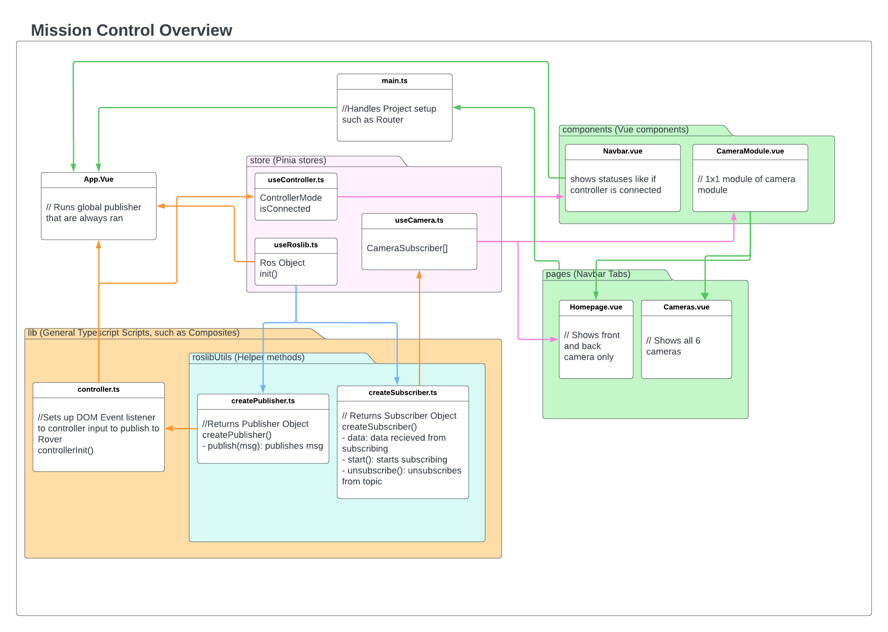

# Code Overview

Picture below shows how Camera and Controller interact with the codebase


- **store**: Put all global states here. Every store should have one purpose. Put subscribers and publishers here, so that there is one place to find the topic names.
- **components**: Single file component vue files that contain localized state (aka other components will not use it). Do not directly use createSubscriber and createPublisher here. Instead put them into the store.
- **lib**: [Vue Composables](https://vuejs.org/guide/reusability/composables) and any large amount of .ts files goes here.
- **pages** Each tab in the navbar has its pages. Generally, there should be no state stored here as the components and store should have them.
- **App.vue**: Pubs and Subs that are always running and not part of a component such as the controller should be ran here.
- **types.ts** Put all global types here.

## Design choices

We are using Vue for its reactivity and lightweightness alongside Pinia, a global state management to handle the growing amount of state shared among components. Pinia has the benefit of running before the app, ensuring the ros object is always initialized. We use Typescript to make the code more readable and maintainable. Because ROS uses the publisher and subscriber paradigm, we use Roslibjs library to easily interact with ROS in TypeScript, allowing us to use publishers, subscribers, and services, without having to manually create our own protocol to send data back and forward between the rover and the mission control. The WebSocket and the protocol is through Rosbridge Suite.

## How the Rover and the Mission Control communicates under the hood

The rover runs Ros server which creates a WebSocket server that then the mission control connects to as it is ran on the browser. The connection is TCP and is able to send data bidirectional. Any interactions such as subscribing and publishing under the hood are just JSON sent back and forward. This is all done for us and we simply use the Roslibjs library. Below is an example of Chrome dev tools-> network-> WS (WebSocket) on what the JSON message being sent looks like.


For a deeper dive, refer to the [Rosbridge_Protocol.md](https://github.com/RobotWebTools/rosbridge_suite/blob/ros2/ROSBRIDGE_PROTOCOL.md).

## Module System

To easily move components around, we will create "Modules" to fit in the 2x3 grid system. Most Modules will be 1x1, but if necessary, can be bigger such as 2x2 1x2, and 2x1.


## Code Philosophy

Philosophy on keeping the codebase clean and efficient.

1. **Don't send or receive unnecessary data**: Due to the distance between the Rover and the base station during competition (~1 km), the rover will have limited bandwidth. So whenever a component like a camera is not being used, unsubscribe from that topic.

Example in `ExampleComponent.vue`:

```Typescript
// Starts subscriber when in view
onActivated(() => {
  example.helloWorldSub.start();
});
// Cleanup Auto unsubscribes when not loaded to save bandwidth
onDeactivated(() => {
  example.helloWorldSub.stop();
});
```

2. **Do not directly use the Ros object**: The ros object has a lot of functionalities, and many ways to code the same thing. For standardization and encapsulation purposes, use createPublisher and createSubscribers instead. If there is a feature like getTopics(), create a function in useRoslib that returns it. If the feature is more reusable, like services, create a composite for it.
